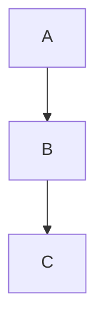
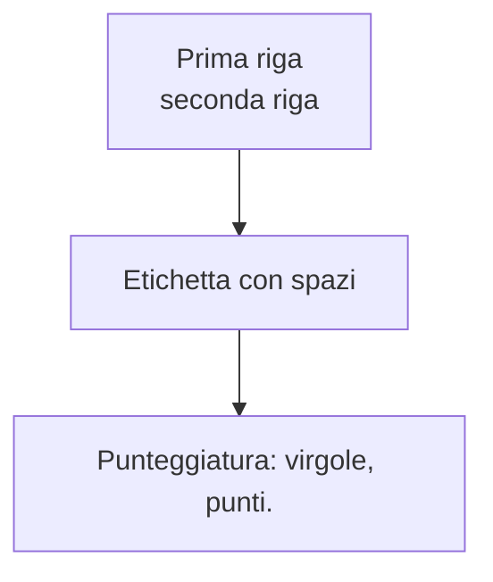
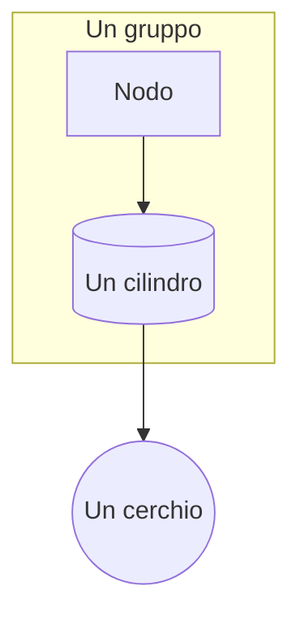
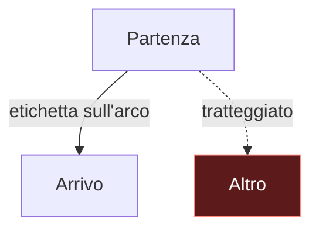
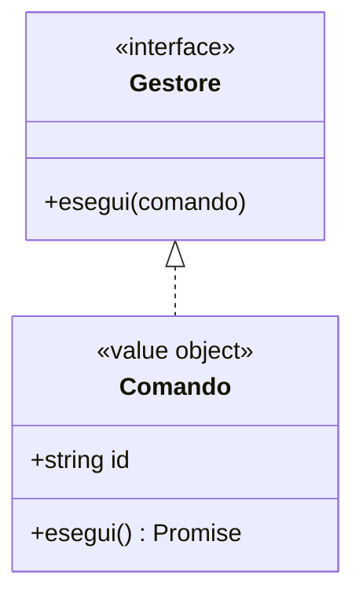
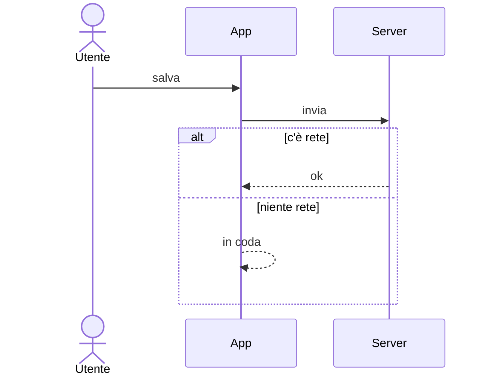

# Mermaid — scala di prova per la preview

Apri questo file in VSCode e fai `Ctrl+Shift+V`. **Non modificare nulla mentre guardi**: una
scrittura sul file fa ripartire il refresh e interrompe il render.

Guarda fin dove arriva la scala e riferisci il numero dell'ultimo che si vede. Ognuno aggiunge una
sola cosa rispetto al precedente, così il primo che sparisce nomina il colpevole.

Se **il n.1 non si vede**, non è il contenuto: è l'estensione. Vedi «Se salta anche il n.1» in fondo.

---

## 1. Minimo assoluto — tre nodi, niente altro

## 2. Aggiunge: etichette quotate e ` `

## 3. Aggiunge: subgraph e forme

## 4. Aggiunge: classDef, class ed etichette sugli archi

## 5. Aggiunge: classDiagram, con annotazioni

## 6. Aggiunge: sequenceDiagram, con alt/else

---

## Come leggere il risultato

| ultimo visibile | cosa dice |
|---|---|
| nessuno | non è il contenuto: l'estensione non renderizza affatto |
| 1–3 | rompe qualcosa fra `classDef`/`class` e le etichette sugli archi |
| 4 | rompono i tipi di diagramma diversi dal flowchart |
| 5 | rompe il `sequenceDiagram` |
| tutti e 6 | la preview funziona: il problema è specifico del documento grande — prova `markdown-mermaid.maxTextSize` e il numero di diagrammi per file |

## Se salta anche il n.1

Non c'è niente da correggere nei documenti. In ordine:

1. **Non stavi scrivendo il file mentre guardavi?** È la causa più frequente in assoluto.
2. `Ctrl+Shift+P` → *Developer: Reload Window*, poi riapri la preview.
3. `Ctrl+Shift+P` → *Developer: Open Webview Developer Tools* con la preview aperta, e leggi la
   console: è l'unico posto dove l'errore vero compare. Riportalo.
4. Reinstalla `bierner.markdown-mermaid`; se serve, torna a una 1.31.x — le funzioni interattive
   (pan/zoom, resize) sono arrivate nella 1.32.
