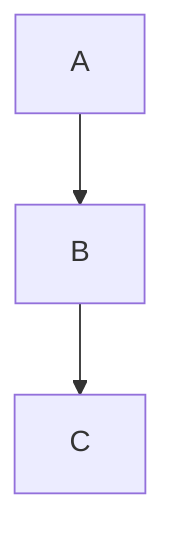
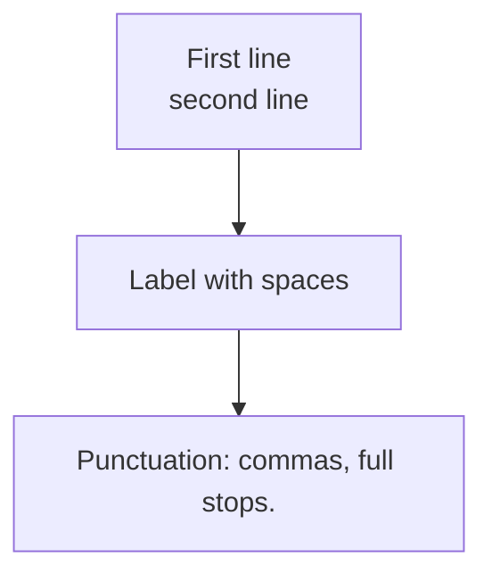
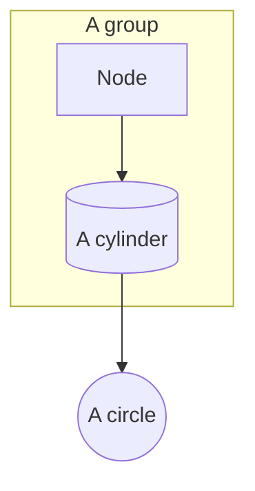
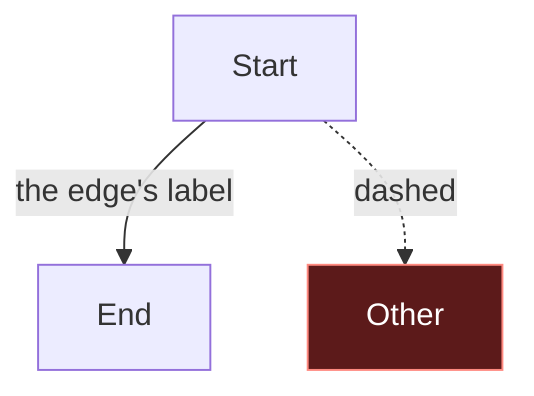
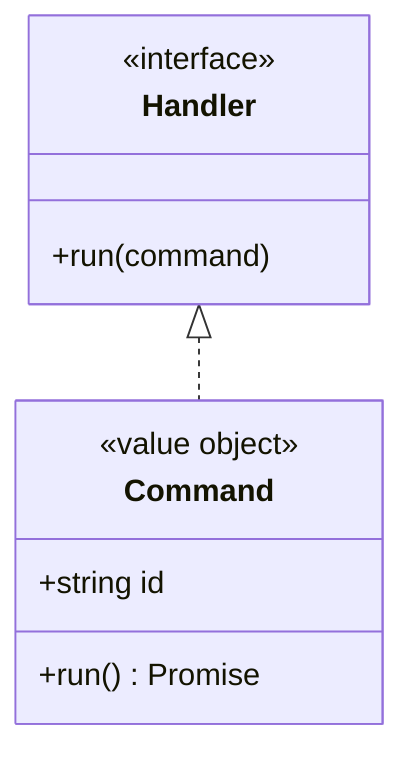
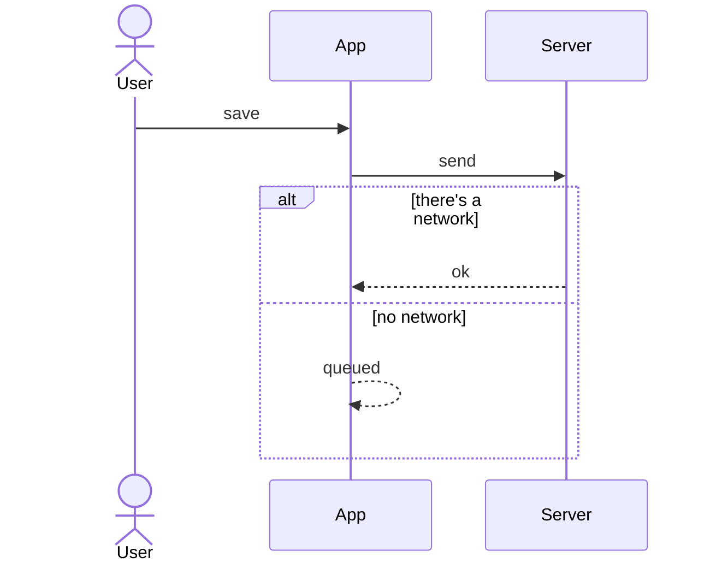

# Mermaid — a test ladder for the preview

Open this file in VS Code and press `Ctrl+Shift+V`. **Do not change anything while you look**: a write to the file
restarts the refresh and interrupts the render.

See how far up the ladder it gets and report the number of the last one that shows. Each one adds a single thing to
the one before, so the first that vanishes names the culprit.

If **number 1 does not show**, it is not the content: it is the extension. See "If even number 1 fails" at the end.

---

## 1. The bare minimum — three nodes, nothing else

## 2. Adds: quoted labels and ` `

## 3. Adds: subgraph and shapes

## 4. Adds: classDef, class and edge labels

## 5. Adds: classDiagram, with annotations

## 6. Adds: sequenceDiagram, with alt/else

---

## How to read the result

| last one visible | what it says |
|---|---|
| none | it is not the content: the extension does not render at all |
| 1–3 | something breaks between `classDef`/`class` and the edge labels |
| 4 | the diagram types other than flowchart break |
| 5 | the `sequenceDiagram` breaks |
| all 6 | the preview works: the problem is specific to the large document — try `markdown-mermaid.maxTextSize` and the number of diagrams per file |

## If even number 1 fails

There is nothing to fix in the documents. In order:

1. **Were you writing the file while you looked?** It is by far the most frequent cause.
2. `Ctrl+Shift+P` → *Developer: Reload Window*, then reopen the preview.
3. `Ctrl+Shift+P` → *Developer: Open Webview Developer Tools* with the preview open, and read the console: it is the
   only place where the real error shows. Report it.
4. Reinstall `bierner.markdown-mermaid`; if needed, go back to a 1.31.x — the interactive features (pan/zoom, resize)
   arrived in 1.32.
