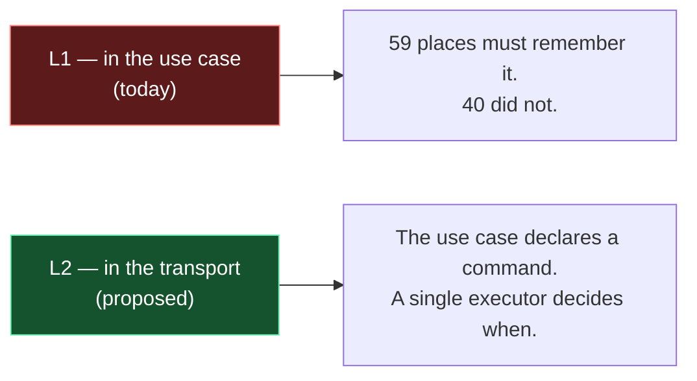

# Architecture documents

An architecture document answers three questions, in this order: **how it is built today**, **what shape it must
take**, **why that one and not another**. Without the third it is not a design, it is a description — and a
description makes nobody take a decision.

The file sits next to the work's spec:

```
<docs>/<work-name>/
  spec.md          the report, the requirements, the point evidence
  architecture.md  this
  diagrams/        NN-name.mmd + NN-name.svg
```

## ⚠️ Two documents, two places, two lives

The first question — **how it is built today** — does not live as long as the other two, and keeping them in one
file makes them rot together. When the area is also **described stably elsewhere** (a living document under
`docs/architecture/`, the one that answers "how does X work"), the two split like this:

| | where | what it holds | when it changes | when it dies |
|---|---|---|---|---|
| **the code as it is NOW** | `docs/architecture/<name>.md` | the current shape, the **measured** defects with their evidence at `file:line`, the invariants, and **the map `defect / closed by / state`** | **when the code it describes changes** | never — it outlives the entries that cite it |
| **the architecture being CHANGED** | the document the work already has — `spec.md`/`plan.md`/`report.md` — with `diagrams/` beside it | the target shape with its diagram, the phases, which defects it touches, the acceptance criterion | when the plan changes | with the work: it goes to `archive/` |

⚠️ **The split is between the two PLACES, not inside the work's folder.** There, merge: an `architecture.md` next to
a `plan.md` that already has "The design" and "Acceptance" duplicates instead of splitting. A new file name is added
only when it answers a question the others do not.

**The defect map lives in the stable document**, not in the work's: an entry's folder goes to `archive/` when the
entry closes, and would take with it the only place that says **which defects nobody is closing** — exactly the ones
no open work can keep. The work's document keeps one line: which defects *this* work touches.

The reason is that the first file **outlives** the work and the second does not. A stable architecture document that
carries the phases of an entry closed months ago is one nobody trusts any more; and an acceptance criterion parked in
a file headed for `archive/` vanishes exactly when it is needed to verify the work.

From this follows the more useful rule of the two: **the acceptance criterion is written in the migration's document,
and points at the architecture document.** Not "when done, the code will do X" — which nobody can check — but
*"updating `architecture/<name>.md` must produce these transformations: the two-column table becomes one column,
defect D3 leaves the open defects, the document's title no longer holds"*. **If the update does not produce them, the
work is not done**, however the code looks. It works only because the target is a file **someone else maintains**:
that is the reason the two are kept apart, not a consequence of it.

If the area has **no** stable document, the three questions stay in one file — the split is for when there is
something to split, not for symmetry.

## When it is needed, and when not

| needed | not needed |
|---|---|
| the work touches several layers, or redraws them | the change has an obvious implementation |
| the defect is **structural** (it comes back if you patch it) | it is a point bug: the spec is enough |
| there is a real alternative to reject | there is only one road |
| the work ships in several phases | it is one commit |

The line with the spec is sharp: **the spec carries the facts, the architecture carries the shape.** The report, the
requirements and the point evidence live there; here they are linked, not repeated.

## ⚠️ The tail of a LIVING document: four sections, always the same

For the stable documents under `docs/architecture/`, and the part forgotten first — because it is the only one that
speaks not about the code but about **who keeps it**. At the end, in this order:

| section | what it holds | what it asks the reader |
|---|---|---|
| **Open defects** | numbered items `D<n>`, each with its evidence at `file:line` | *"this must be done"* |
| **Declared limits, and what they cost** | **measured and accepted** consequences of the design, which nobody will close | *"this is the price, and here is how much"* |
| **Defect owners** | `D<n> / closed by / state` | the only place that shows **what nobody is closing** |
| **Who worked on it** | `[[BKLG-NNN]] / what it left in the code` | the story lives here, **one line per entry** |

(These are the section names the `backlog` skill's gates read by default; a project writing in another language
declares its own names to them.)

The first two under one heading make the area read as **half broken**: a defect to close and an accepted limit do not
ask the same thing. And a limit **is not deleted** when it is decided not to close it — the measurement behind the
decision would vanish, and in three months someone proposes again the remedy already rejected.

A number **leaves** when the **CODE** changes, and **moves** between the first two when its *nature* changes, not its
weight (rule 3: numbers are never recycled).

⚠️ **There is no "Closed defects" section**: it is how the story climbs back in through the window — a closed item
reads as current state. What an entry closed is **one row in "Who worked on it"** (rule 4). Measured on a real
document: a table of closed defects and **no** "Who worked on it" section — exactly that swap.

The same holds for the **empty** section: *"None"* under "Open defects" is information — it says there is no pending
work on the area, not that nobody looked.

## The skeleton

Five sections. Each exists for a question; if a question has no answer, the section is removed, not filled.

| # | section | must contain |
|---|---|---|
| 1 | **How it is built today** | the diagram of the current layers, the **numbered structural defects** (D1…Dn), and **the count** |
| 2 | **The founding decision** | the real options side by side, the rejected ones **with their cost**, and the choice |
| 3 | **The target architecture** | the diagram of the new shape, how the layers talk (a numbered list), the components in UML, the critical path |
| 4 | **Design decisions** | the table `# / decision / choice / why`, **what does NOT change**, **the main risk** |
| 5 | **Phases** | the table `phase / what it delivers`, and which phase first gives the user back what they reported |

When there are two files, section 1 **is not duplicated**: the numbered defects live in the stable document (they are
measured properties of today's code, and close when the code changes), and the migration's document refers to them
with a **`defect / closed by / state`** table. That table is also where *what is missing* shows: defects with no work
to close them are marked, not left implicit.

## The nine rules that make the difference

The skeleton is the easy part. What separates a useful document from a neat essay:

1. **Every defect is structural, numbered and proven.** A bold line stating the defect, then its evidence at
   `file:line`. `D3 — The transport is written inside the use case, 19 times.` The numbers exist so the rest of the
   document can refer to them: "D4 disappears" is a sentence that can be checked. A defect without evidence is an
   opinion; a defect that does not come back on its own is a bug, and bugs belong in the spec.

2. **The count is measured, not estimated.** A table of numbers — how many calls, how many covered, how many
   forgotten — obtained with a command, not by eye. **And check the denominator**: counting "the domains with a
   queued action" leaves out the reads nobody writes, and the hole shows at the end, when the work looked finished.

3. **A CLOSED defect leaves the document.** The defects section holds only the **open** ones: an architecture document
   describes how the code is *now*, and a closed item no longer does — it reads as current state, which is how a
   document becomes false without any line being wrong. Measured on one document: four closed defects out of seven
   took **287 lines** of past-tense prose, more than half the section, and the reader had to work out which were
   still true. **Where the story goes**: into the **entry** that closed the defect (rule 4).
   ⚠️ **Numbers are never recycled**, and the document says which have left and toward which entry: the closed
   entries and the commits that cite `D2` still exist, and a new `D2` would make them lie.

4. **The document carries the PRESENT and a list of links; the past lives in the entries.** An architecture file holds
   what is there now, not the problems there were and how they were solved — the linked backlog entries are for that.
   Once a problem is solved, what remains is the clean design of what exists, then the plain list of who worked on it.

   An **open** defect stays in the document: it is a property of the code of now, and that section is the only place
   that shows what nobody is closing. All the rest of the past — what was broken, how it was fixed, what was believed
   before — **does not describe the code of now**, so it does not belong here. It belongs in the entry, which is made
   for that and survives in `archive/`.

   Hence the closing move, the one usually skipped: when a piece of work closes a defect the document **does not
   gain** a paragraph telling the closure. It **loses** one — the defect's item — and gains **one line in a list**:

   ```markdown
   ## Who worked on it
   | | |
   |---|---|
   | [[BKLG-012]] | every import asks the catalogue for the record's identity |
   | [[BKLG-019]] | the CSV import goes through the same lookup |
   ```

   One line per entry, no story: whoever wants to know *what* happened opens the entry, which has the plan, the
   measurements and the migration's diagram. Duplicating it here makes two versions of the same story, and the one in
   the document ages first because nobody rereads it.

   ⚠️ **`> Corrected/Updated on <date>` blocks are TRANSIENT, not an archive.** They serve while a false sentence is
   still in circulation and someone might remember it; then the sentence is rewritten right and the block goes,
   because a new reader has nothing to unlearn. Measured: two documents carried **21** and **9** of them — at that
   point they are no longer corrections, they are a second past-tense document wedged inside the first. The
   traceability they defended is not lost: it is in `git log`, in the linked entry and in the list's row.

   The test, on any paragraph: **does it describe how the code is now?** If it is in the past tense, or names a closed
   entry to explain *why* something changed, it goes into the entry.

5. **At least one rejected alternative, with its price written down.** "We chose X" is not a decision until it says
   what Y would have cost. The cost is concrete: a store to own, sync rules to keep aligned with security, one more
   dependency. If no alternative had a price, no document was needed.

6. **Decisions live in a table, one row each, with the why beside it.** Not in scattered prose: they must be
   rereadable in twenty seconds six months from now, and it is the only place where an accepted risk
   ("last-write-wins, one user on two devices") becomes explicit instead of implicit.

7. **"What does NOT change" and "the main risk" are not optional.** The first bounds the work — it tells the reader
   where to stop worrying. The second names **the invariant this work has no right to break**, and it is written before
   starting, not after breaking it.

8. **Phases say what they deliver, not what they touch.** "F4 — outbox + registry: the 19 branches disappear and the
   40 forgotten ones are covered by themselves", not "F4 — changes to transactions.ts". And say which phase first
   gives the user back the thing they reported: the rest is structural work, and it must be said that it is.

9. **The diagram is part of the document, not an illustration: it is updated in the SAME pass as the prose.** This is
   the rule easiest to skip, because the prose is already being written and the `.mmd` is another file — and the cost
   of skipping is lopsided: **the diagram is what gets looked at first**, so a right paragraph over an old picture
   reads as a right picture and a confusing paragraph. A `> Updated on <date>` block repairs nothing if the drawing
   above still says the old thing.

   Measured twice in one session: the prose of a first gate updated while its two diagrams still said "compares two
   strings"; then, fixing a second gate, its node left with only the label "fail-open". Neither mistake is visible
   rereading the text.

   Three moves, in this order, every time a change touches a section that has a diagram:
   - **grep the `.mmd` for the names you are changing** (a renamed function, a new field, a branch that disappears).
     It is the ten-second check that finds everything.
   - **regenerate and look at the sizes**: an absurd ratio, or a file whose size does not change, says the render did
     not take what you thought.
   - **ask whether the change opened a section without a diagram.** If a section has just gained a real decision and
     its twin has a drawing, the missing one is a hole, not a choice — the same day, the second gate turned out to have
     no diagram while the first had had one from day one.

## Diagrams: one per question

| the section's question | type | how |
|---|---|---|
| how it is built today / the target shape | `flowchart TD` | one `subgraph` per layer, the arrows say who calls whom |
| which options there were | `flowchart LR` | one branch per option, a `classDef` to mark the chosen and the rejected |
| which pieces it is made of | `classDiagram` | `<<interface>>` on the contracts, the relations between the classes |
| how the critical path runs | `sequenceDiagram` | `alt`/`else` for the two worlds (online / offline) |

One diagram per question: two diagrams that say the same thing mean the question was one. **The diagram carries the
structure, the prose carries the numbers** — a label that wants a sentence is prose in disguise.

The chosen and the rejected option read at a glance:



**From three diagrams up, live blocks do not show** — the VS Code preview cancels the render in progress and leaves
empty boxes, with no error. Above that threshold the sources live in `diagrams/*.mmd` and the document embeds the
SVGs. Procedure, validator and renderer: the **mermaid-diagrams** skill. The document opens with the note that says
why:

```markdown
> The diagrams are **SVGs pre-rendered** from the sources in `diagrams/*.mmd`, not live mermaid blocks: the VS Code
> preview cancels the render in progress on every update. Details in the `mermaid-diagrams` skill.
```

and under each image goes the line that makes the `.mmd` the source of truth:

```markdown


<sub>Source: [`diagrams/01-name.mmd`](./diagrams/01-name.mmd). Regenerate with `node scripts/mermaid.mjs render <the-diagrams-folder>` — see the `mermaid-diagrams` skill.</sub>
```

## Common mistakes

| mistake | how to spot it | what to do |
|---|---|---|
| it describes instead of deciding | no rejected option, no cost | section 2, or the document was not needed |
| numbers by eye | "about", "most of" | measure them, and check the denominator |
| it repeats the spec | half a page of the report | link the spec |
| defects as a bug list | "an `await` is missing in X" | it is a bug: spec or backlog, not here |
| the diagram explains | labels a sentence long | the sentence goes in the prose, the diagram stays structure |
| a decorative diagram | it answers no question of the table | remove it |
| the story of the fix stays in the document | past-tense paragraphs: "it was broken", "before it did", "closed by [[BKLG-…]] because…" | rewrite the present right; the story goes into the entry, and here stays **one line** in "Who worked on it" (rule 4) |
| dated blocks piling up | more than two or three `> Corrected/Updated on …` in one file | they are transient: absorb them into the present-tense text and remove them |
| the frame tells the WORK, not the code | headings like "the case that started all this", "what does NOT change" (in a stable document), "axis A: OPEN" | the content is often fine where it is: change the **frame**. A measured case is a **worked example of the rule** ("the gate at work, with the numbers"), not the origin of an entry; invariants are **properties the code keeps**, not promises; a state is "they diverge", not "OPEN" |
| phases that list files | "F2 — changes to network.ts" | write what it delivers |
| **updated prose over an old diagram** | the paragraph says one thing, the picture above it another | regenerate the `.mmd` **in the same pass**, never "later" — rule 9 |
