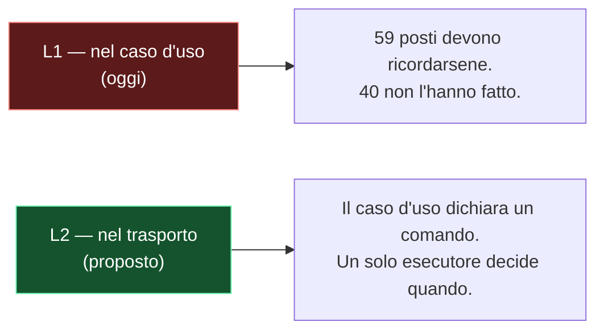

# Documenti di architettura

Un documento di architettura risponde a tre domande, in quest'ordine: **com'e' fatto oggi**, **che
forma deve avere**, **perche' quella e non un'altra**. Senza la terza non e' un progetto, e' una
descrizione — e una descrizione non fa prendere nessuna decisione a nessuno.

Il file sta accanto allo spec del lavoro:

```
<docs>/<nome-del-lavoro>/
  spec.md          la segnalazione, i requisiti, le prove puntuali
  architecture.md  questo
  diagrams/        NN-nome.mmd + NN-nome.svg
```

## ⚠️ Due documenti, due posti, due vite

La prima domanda — **com'e' fatto oggi** — non ha la stessa vita delle altre due, e tenerla nello
stesso file le fa marcire insieme. Quando l'area descritta e' anche **descritta stabilmente altrove**
(un documento vivo sotto `docs/architecture/`, quello che risponde a «come funziona X»), i due si
dividono cosi':

| | dove | cosa contiene | quando cambia | quando muore |
|---|---|---|---|---|
| **il codice com'e' ORA** | `docs/architecture/<nome>.md` | la forma attuale, i difetti **misurati** con la prova a `file:riga`, le invarianti, e **la mappa `difetto / chi lo chiude / stato`** | **quando cambia il codice** che descrive | mai — sopravvive alle entry che lo citano |
| **l'architettura che si sta MODIFICANDO** | il documento che il lavoro ha gia' — `spec.md`/`plan.md`/`report.md` — con `diagrams/` accanto | la forma target col diagramma, le fasi, quali difetti tocca, il criterio di accettazione | quando cambia il piano | con il lavoro: finisce in `archive/` |

⚠️ **La divisione e' fra i due POSTI, non dentro la cartella del lavoro.** Li' si accorpa: un
`architecture.md` accanto a un `plan.md` che ha gia' «Il disegno» e «Accettazione» duplica invece di
dividere. Un nome di file nuovo va aggiunto solo quando risponde a una domanda che gli altri non
coprono.

E la **mappa dei difetti sta nel documento stabile**, non in quello del lavoro: la cartella di
un'entry finisce in `archive/` quando l'entry chiude, e si porterebbe via l'unico posto dove e'
scritto **quali difetti non li sta chiudendo nessuno** — proprio quelli che nessun lavoro aperto puo'
custodire. Nel documento del lavoro resta una riga: quali difetti tocca *questo*.

Il motivo e' che il primo file **sopravvive** al lavoro e il secondo no. Un documento di architettura
stabile che porta dentro di se' le fasi di un'entry chiusa mesi fa e' un documento che nessuno si
fida piu' di leggere; e un criterio di accettazione parcheggiato in un file che va in `archive/`
sparisce proprio quando servirebbe verificarlo.

Ne segue la regola piu' utile delle due: **il criterio di accettazione si scrive nel documento della
migrazione, e punta a quello di architettura.** Non «a lavoro finito il codice fara' X» — che nessuno
puo' controllare — ma *«aggiornare `architecture/<nome>.md` deve produrre queste trasformazioni: la
tabella a due colonne diventa a una, il difetto D3 passa al passato, il titolo del documento non
regge piu'»*. **Se l'aggiornamento non le produce, il lavoro non e' finito**, comunque appaia il
codice. Funziona solo perche' il bersaglio e' un file **che qualcun altro mantiene**: e' la ragione
per cui i due stanno separati, non una conseguenza.

Se l'area **non** ha un documento stabile, le tre domande restano in un file solo — la divisione
serve quando c'e' qualcosa da dividere, non per simmetria.

## Quando serve, e quando no

| serve | non serve |
|---|---|
| il lavoro tocca piu' livelli, o li ridisegna | la modifica ha un'implementazione ovvia |
| il difetto e' **strutturale** (torna da solo se lo tappi) | e' un bug puntuale: basta lo spec |
| esiste un'alternativa vera da scartare | c'e' una sola strada |
| il lavoro esce in piu' fasi | e' un commit |

Il confine con lo spec e' netto: **lo spec porta i fatti, l'architettura porta la forma.** Segnalazione,
requisiti e prove puntuali stanno li'; qui si linkano, non si ripetono.

## ⚠️ La coda di un documento VIVO: quattro sezioni, e sono sempre quelle

Vale per i documenti stabili sotto `docs/architecture/`, ed e' la parte che si dimentica per prima —
perche' e' l'unica che non parla del codice ma di **chi lo tiene**. In coda, in quest'ordine:

| sezione | cosa contiene | cosa chiede al lettore |
|---|---|---|
| **I difetti aperti** | voci numerate `D<n>`, ognuna con la prova a `file:riga` | *«questo va fatto»* |
| **I limiti dichiarati, con quanto costano** | conseguenze **misurate e accettate** del disegno, che nessuno chiudera' | *«questo e' il prezzo, ed ecco quanto»* |
| **Chi possiede ciascun difetto** | `D<n> / chi lo chiude / stato` | e' l'unico posto dove si vede **cosa non sta chiudendo nessuno** |
| **Chi ci ha lavorato** | `[[BKLG-NNN]] / cosa ha lasciato nel codice` | il racconto sta qui, **una riga per entry** |

Le prime due sotto un titolo solo fanno leggere l'area come **mezza rotta**: un difetto da chiudere e
un limite accettato non chiedono la stessa cosa. E un limite **non si cancella** quando si decide di
non chiuderlo — sparirebbe la misura che regge la decisione, e fra tre mesi qualcuno ripropone il
rimedio gia' scartato.

Un numero **esce** quando cambia il **CODICE**, e **passa** fra le prime due quando cambia la sua
*natura*, non il suo peso. **I numeri non si riciclano mai**: il documento dice quali sono usciti e
verso quale entry.

⚠️ **Una sezione «I difetti usciti» NON esiste**, ed e' la forma in cui il racconto rientra dalla
finestra: una voce chiusa si legge come stato attuale. Cio' che una entry ha chiuso e' **una riga in
«Chi ci ha lavorato»**. Misurato l'11/08 su `manga-bento-import.md`: aveva una tabella di difetti
chiusi e **nessuna** sezione «Chi ci ha lavorato» — esattamente lo scambio. Il modello da copiare e'
`remote-catalog-search.md`.

L'esemplare vale anche per la sezione **vuota**: *«Nessuno»* sotto «I difetti aperti» e'
un'informazione — dice che su quest'area non c'e' lavoro in sospeso, non che nessuno ha guardato.

## Lo scheletro

Cinque sezioni. Ognuna esiste per una domanda; se una domanda non ha risposta, la sezione va tolta,
non riempita.

| # | sezione | deve contenere |
|---|---|---|
| 1 | **Com'e' fatto oggi** | il diagramma dei livelli attuali, i **difetti strutturali numerati** (D1…Dn), e **il conto** |
| 2 | **La decisione di fondo** | le opzioni reali messe una accanto all'altra, quelle scartate **con il loro scarto**, e la scelta |
| 3 | **L'architettura target** | il diagramma della forma nuova, come si parlano i livelli (elenco numerato), i componenti in UML, il percorso critico |
| 4 | **Decisioni di progetto** | la tabella `# / decisione / scelta / perche'`, **cosa NON cambia**, **il rischio principale** |
| 5 | **Fasi** | tabella `fase / cosa consegna`, e quale fase da' per prima all'utente la cosa che ha visto |

Quando c'e' la divisione in due file, la sezione 1 **non si duplica**: i difetti numerati vivono nel
documento stabile (sono proprieta' misurate del codice di oggi, e si chiudono quando il codice
cambia), e il documento della migrazione ci si riferisce con una tabella **`difetto / chi lo chiude /
stato`**. Quella tabella e' anche il posto dove si vede *cosa manca*: i difetti senza un lavoro che
li chiuda vanno marcati, non lasciati impliciti.

## Le nove regole che fanno la differenza

Lo scheletro e' la parte facile. Quello che separa un documento utile da un tema in bella copia:

1. **Ogni difetto e' strutturale, numerato e provato.** Una riga in grassetto che dice il difetto,
   poi la prova a `file:riga`. `D3 — Il trasporto e' scritto dentro il caso d'uso, 19 volte.` I numeri
   servono perche' il resto del documento ci si riferisca: «D4 sparisce» e' una frase che si puo'
   verificare. Un difetto senza prova e' un'opinione; un difetto che non torna da solo e' un bug, e i
   bug stanno nello spec.

2. **Il conto si misura, non si stima.** Una tabella di numeri — quante chiamate, quante coperte,
   quante dimenticate — ottenuti con un comando, non a occhio. **E si controlla il denominatore**:
   contare «i domini con un gesto in coda» lascia fuori le letture che nessuno scrive, e il buco si
   scopre alla fine, quando il lavoro sembrava finito.

3. **Un difetto CHIUSO esce dal documento** (direzione dell'utente, 2026-08-07). La sezione dei
   difetti tiene solo quelli **aperti**: un documento di architettura descrive com'e' fatto il codice
   *adesso*, e una voce chiusa non lo descrive piu' — la si legge come stato attuale, ed e' il modo in
   cui un documento diventa falso senza che nessuna riga sia sbagliata. Misurato su
   `title-match-gate.md`: quattro difetti chiusi su sette occupavano **287 righe** di prosa al passato,
   piu' della meta' della sezione, e chi la apriva doveva capire da solo quali fossero ancora veri.
   **Dove va la storia**: nell'**entry** che ha chiuso il difetto — regola 4, che dice dove va TUTTO
   il passato di un documento.
   ⚠️ **I numeri non si riciclano mai**, e il documento dice quali sono usciti e verso quale entry: le
   entry chiuse e i commit che citano `D2` continuano a esistere, e un `D2` nuovo li farebbe mentire.

4. **Il documento porta il PRESENTE e un elenco di link; il passato sta nelle entry**
   (direzione dell'utente, 2026-08-09):

   > *«i file di architettura devono contenere informazione sull'attuale, non spiegazioni dei problemi
   > che ci sono stati e delle risoluzioni — per quello ci sono i backlog collegati. Una volta risolti
   > deve restare il disegno pulito di cosa c'e', poi la lista semplice di chi ci ha lavorato.»*

   Un difetto **aperto** sta nel documento: e' una proprieta' del codice di adesso, e quella sezione e'
   l'unico posto dove si vede cosa non sta chiudendo nessuno. Tutto il resto del passato — cosa era
   rotto, com'e' stato aggiustato, cosa si credeva prima — **non descrive il codice di adesso**, quindi
   non sta qui. Sta nell'entry, che e' fatta per quello e che sopravvive in `archive/`.

   Ne segue la forma di chiusura, ed e' quella che di solito non si fa: quando un lavoro chiude un
   difetto il documento **non guadagna** un paragrafo che racconta la chiusura. Ne **perde** uno — la
   voce del difetto — e guadagna **una riga in una lista**:

   ```markdown
   ## Chi ci ha lavorato
   | | |
   |---|---|
   | [[BKLG-406]] | ogni creazione chiede l'identita' ai cataloghi |
   | [[BKLG-413]] | l'import MangaBento passa dalla stessa ricerca |
   ```

   Una riga per entry, senza racconto: chi vuole sapere *cosa* e' successo apre l'entry, che ha il
   piano, le misure e il diagramma della migrazione. Duplicarlo qui produce due versioni della stessa
   storia, e quella nel documento invecchia per prima perche' nessuno la rilegge.

   ⚠️ **I blocchi `> Corretto/Aggiornato il <data>` sono TRANSITORI, non un archivio.** Servono finche'
   una frase falsa e' ancora in circolazione e qualcuno potrebbe ricordarsela; poi la frase si riscrive
   giusta e il blocco esce, perche' un lettore nuovo non ha niente da disimparare. Misurato il 09/08:
   `title-match-gate.md` ne aveva **21** e `external-identity.md` **9** — a quel punto non sono piu'
   correzioni, sono un secondo documento al passato incastrato dentro il primo. La tracciabilita' che
   difendevano non si perde: sta in `git log`, nell'entry linkata e nella riga della lista.

   Il test, su qualunque paragrafo: **descrive come e' fatto il codice adesso?** Se e' al passato, o
   nomina un'entry chiusa per spiegare *perche'* qualcosa e' cambiato, va nell'entry.

5. **Almeno un'alternativa scartata, con il prezzo scritto.** «Abbiamo scelto X» non e' una decisione
   finche' non c'e' scritto cosa costava Y. Lo scarto e' concreto: uno store da possedere, le regole di
   sync da tenere allineate con la sicurezza, una dipendenza in piu'. Se nessuna alternativa aveva un
   prezzo, non serviva un documento.

6. **Le decisioni stanno in tabella, una riga l'una, con il perche' accanto.** Non in prosa sparsa: si
   devono poter rileggere fra sei mesi in venti secondi, ed e' l'unico posto dove un rischio accettato
   («last-write-wins, un utente su due dispositivi») diventa esplicito invece che implicito.

7. **«Cosa NON cambia» e «il rischio principale» non sono opzionali.** Il primo delimita il lavoro —
   e' cio' che dice al lettore dove smettere di preoccuparsi. Il secondo nomina **l'invariante che
   questo lavoro non ha il diritto di rompere**, e va scritto prima di iniziare, non dopo averlo rotto.

8. **Le fasi dicono cosa consegnano, non cosa toccano.** «F4 — outbox + registry: i 19 rami spariscono
   e i 40 dimenticati si coprono da soli», non «F4 — modifiche a transactions.ts». E si dichiara quale
   fase restituisce per prima all'utente la cosa che ha segnalato: il resto e' lavoro strutturale, e va
   detto che lo e'.

9. **Il diagramma e' parte del documento, non un'illustrazione: si aggiorna nello STESSO passaggio
   della prosa.** Questa e' la regola piu' facile da saltare, perche' la prosa la stai gia' scrivendo e
   il `.mmd` e' un altro file — e il costo del salto e' asimmetrico: **il diagramma e' quello che si
   guarda per primo**, quindi un paragrafo giusto sopra un'immagine vecchia si legge come un'immagine
   giusta e un paragrafo confuso. Un blocco `> Aggiornato il <data>` non ripara niente se il disegno
   sopra dice ancora la cosa vecchia.

   Misurato il 2026-08-06, due volte nella stessa sessione: aggiornata la prosa del cancello 1 mentre i
   suoi due diagrammi dicevano ancora «confronta due stringhe»; poi, correggendo il cancello 2, lasciato
   il suo nodo con la sola dicitura «fail-open». Nessuno dei due errori e' visibile rileggendo il testo.

   Tre mosse, in quest'ordine, ogni volta che una modifica tocca una sezione che ha un diagramma:
   - **grep del `.mmd` per i nomi che stai cambiando** (una funzione rinominata, un campo nuovo, un
     ramo che sparisce). E' il controllo che costa dieci secondi e trova tutto.
   - **rigenera e guarda le dimensioni**: un rapporto assurdo o un file che non cambia dimensione
     dicono che il render non ha preso ciò che credevi.
   - **chiedi se il cambiamento ha aperto una sezione senza diagramma.** Se una sezione ha appena
     guadagnato una decisione vera e la sua gemella un disegno ce l'ha, la mancanza e' un buco, non una
     scelta — nello stesso giorno il cancello 2 si e' rivelato senza diagramma mentre il cancello 1 ne
     aveva uno dal primo giorno.

## I diagrammi: uno per domanda

| domanda della sezione | tipo | come |
|---|---|---|
| com'e' fatto oggi / la forma target | `flowchart TD` | un `subgraph` per livello, le frecce dicono chi chiama chi |
| quali opzioni avevo | `flowchart LR` | un ramo per opzione, `classDef` per marcare scelta e scartata |
| di che pezzi e' fatto | `classDiagram` | `<<interface>>` sui contratti, le relazioni fra le classi |
| come si svolge il percorso critico | `sequenceDiagram` | `alt`/`else` per i due mondi (con rete / senza) |

Un diagramma per domanda: due diagrammi che dicono la stessa cosa vogliono dire che la domanda era una
sola. **Il diagramma porta la struttura, la prosa porta i numeri** — un'etichetta che vuole una frase
e' prosa travestita.

L'opzione scelta e quella scartata si leggono a colpo d'occhio:



**Da tre diagrammi in su i blocchi live non si vedono** — la preview di VSCode annulla il render in
corso e lascia riquadri vuoti, senza dare errore. Sopra quella soglia i sorgenti stanno in
`diagrams/*.mmd` e il documento incorpora gli SVG. Procedura, validatore e renderer: skill
**mermaid-diagrams**. Il documento apre con la nota che spiega perche':

```markdown
> I diagrammi sono **SVG pre-renderizzati** dai sorgenti in `diagrams/*.mmd`, non blocchi mermaid
> live: la preview di VSCode annulla il render in corso a ogni aggiornamento. Dettagli nella skill
> `mermaid-diagrams`.
```

e sotto ogni immagine va la riga che rende il `.mmd` la fonte di verita':

```markdown


<sub>Sorgente: [`diagrams/01-nome.mmd`](./diagrams/01-nome.mmd). Rigenera con `node scripts/mermaid.mjs render <cartella-dei-diagrammi>` — vedi la skill `mermaid-diagrams`.</sub>
```

## Errori comuni

| errore | come si riconosce | cosa fare |
|---|---|---|
| descrive invece di decidere | nessuna opzione scartata, nessuno scarto | sezione 2, o il documento non serviva |
| numeri a occhio | «circa», «la maggior parte» | misurali, e controlla il denominatore |
| ripete lo spec | mezza pagina di segnalazione | linka lo spec |
| difetti come elenco di bug | «manca un `await` in X» | e' un bug: spec o backlog, non qui |
| il diagramma spiega | etichette lunghe una frase | la frase va nella prosa, il diagramma resta struttura |
| diagramma decorativo | non risponde a nessuna domanda della tabella | toglilo |
| il racconto della risoluzione resta nel documento | paragrafi al passato: «era rotto», «prima faceva», «chiuso da [[BKLG-…]] perche'…» | il presente si riscrive giusto; il racconto va nell'entry, e qui resta **una riga** in «Chi ci ha lavorato» (regola 4) |
| blocchi datati che si accumulano | piu' di due o tre `> Corretto/Aggiornato il …` nello stesso file | sono transitori: assorbili nel testo al presente e toglili |
| la cornice racconta il LAVORO, non il codice | titoli come «il caso che ha aperto tutto questo», «cosa NON cambia», «asse A: APERTO» | il contenuto spesso va benissimo dov'e': cambia la **cornice**. Un caso misurato e' un **esempio svolto della regola** («il cancello all'opera, con i numeri»), non l'origine di un'entry; le invarianti sono **proprieta' che il codice tiene**, non promesse; uno stato e' «divergono», non «APERTO» |
| fasi che elencano i file | «F2 — modifiche a network.ts» | scrivi cosa consegna |
| **prosa aggiornata sopra un diagramma vecchio** | il paragrafo dice una cosa, l'immagine sopra ne dice un'altra | rigenera il `.mmd` **nello stesso passaggio**, mai «poi» — vedi la regola 9 |

## L'esemplare

Il documento da cui viene questa skill:
`double-entry-darling/docs/implementations/features/offline-first/architecture.md` (BKLG-044) — cinque
sezioni, cinque diagrammi pre-renderizzati, quattro difetti numerati, la correzione della F1 lasciata
dov'era, sette decisioni in tabella. LIVING DOC: quando un documento di architettura si rivela
sbagliato in un modo nuovo, la regola che sarebbe servita si aggiunge qui.
